# ELVA Notify — Complete System Documentation

> **Document purpose:** Enable a senior engineer to understand, maintain, troubleshoot, redesign, and scale ELVA Notify without access to original developers.
>
> **Product name in code:** `elva-otp-service` (npm package), marketed as **ELVA Notify** / **Notify**.
>
> **Repository:** `elva-notify-platform` monorepo at `backend/`, `frontend/`, `docs/`.
>
> **Last reverse-engineered:** 2026-06-21 from full source trace.

---

# SECTION 1: EXECUTIVE SUMMARY

## What Notify Is

**ELVA Notify** is a multi-tenant notification microservice built on Node.js 18+ and Express 4. It provides:

1. **OTP lifecycle** — generate, deliver, verify, and revoke one-time passwords (6 digits, 5-minute TTL).
2. **Transactional SMS** — India DLT-compliant templated SMS and legacy free-text SMS via Fast2SMS.
3. **Email notifications** — HTML and simple template emails via SendGrid.
4. **Brand governance** — approved brand registry, template allowlists, and self-service onboarding workflow.
5. **Operations portal** — Next.js documentation site with API reference, playground, platform dashboard, and admin approvals.

The system is **synchronous request/response**. There are no message queues, background workers, or relational databases.

## Why It Was Built

ELVA (ElvaTech) operates multiple consumer and B2B applications in India that require:

- **Regulatory compliance** — Indian TRAI DLT rules mandate pre-registered templates, entity IDs (PEID), sender headers, and variable schemas for commercial SMS.
- **Centralized delivery** — one platform credential model (`appId` + `apiKey`) instead of each product integrating Fast2SMS/SendGrid independently.
- **Tenant isolation** — OTP state and brand-specific DLT policies separated by `brandId`.
- **Operational visibility** — structured JSON logs, health snapshots, rollout dashboards, and runbooks for DLT migration.

The v2 architecture (`docs/architecture/ELVA_NOTIFY_V2_ARCHITECTURE.md`) explicitly targets **DLT compliance by construction**: template validation occurs before any provider call.

## Problems It Solves

| Problem | Solution |
|---------|----------|
| DLT template violations causing SMS rejection | Server-side template catalog + variable validation + Fast2SMS `route=dlt` |
| Per-app SMS integration duplication | Unified `/otp/*` and `/notify` APIs |
| OTP security (plaintext storage) | scrypt-hashed OTP + salt in Redis, timing-safe compare |
| OTP abuse (spam/brute force) | Per-phone rate limits, cooldowns, max verify attempts |
| Brand onboarding friction | Self-service request form + admin approval → brand registry |
| Compliance debugging | Category-based structured logs with `requestId`, `templateId`, provider metadata |

## Main Business Use Cases

| Use Case | API | Channel |
|----------|-----|---------|
| User login OTP | `POST /otp/send`, `/otp/verify`, `/otp/resend` | SMS (DLT) or EMAIL |
| Order placed notification | `POST /notify` + `templateKey: ORDER_PLACED` | SMS (DLT) |
| Order delivered / out for delivery | `POST /notify` + `ORDER_DELIVERED`, `OUT_FOR_DELIVERY` | SMS (DLT) |
| Ad-hoc SMS (legacy, non-DLT) | `POST /notify` + `message` | SMS (route `q`) |
| Transactional email | `POST /notify` + `subject` + `html` | EMAIL |
| Brand access onboarding | `POST /integrations/requests` | EMAIL (admin notifications) |

## Customers Using It

Active brands in `backend/config/tenants/brand-registry.json`:

| brandId | Display Name | OTP Policy | Notes |
|---------|--------------|------------|-------|
| `enandi` | eNandi | DLT-only (`legacyRouteEnabled: false`) | Primary production brand |
| `cms` | CMS | Hybrid (DLT + legacy fallback) | Allows route `q` on DLT failure |
| `puma` | PUMA | DLT-only | Approved 2026-06-17 |
| `elva-sales` | ELVA Sales | DLT-only | Approved 2026-06-17 |

All brands use the **ApnaKart** business module (`businessModule: "apnakart"`) for DLT template metadata.

Legacy `appId` mappings in `backend/config/otp-mappings.json` still exist for backward compatibility (`eNandi`, `CMS`).

## Internal Stakeholders

| Role | Interaction |
|------|-------------|
| **Platform engineering** | Backend service, DLT rollout, provider integration |
| **DevOps / SRE** | Redis, backend deployment, health monitoring, runbooks |
| **Product / business ops** | Brand onboarding approvals via `/platform/approvals` |
| **Integration engineers** | Client app wiring via docs portal and playground |
| **Compliance / telecom** | DLT template registration, entity ID management |

## External Integrations

| Integration | Purpose | Protocol |
|-------------|---------|----------|
| **Fast2SMS** | SMS delivery (route `q` legacy, route `dlt` templated) | HTTPS POST `https://www.fast2sms.com/dev/bulkV2` |
| **SendGrid** | Email delivery (OTP, notify, onboarding notifications) | `@sendgrid/mail` SDK |
| **Redis** | OTP storage, rate limits, cooldowns | `redis` npm client v4 |
| **Vercel** | Frontend docs portal hosting | `frontend/vercel.json` |

**Not integrated:** WhatsApp, push notifications (FCM/APNs), AWS SES, Mailgun, Twilio, MSG91, webhooks for delivery reports.

---

# SECTION 2: HIGH LEVEL ARCHITECTURE

## System Components

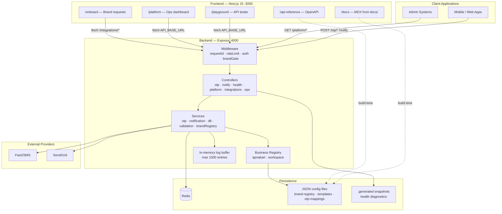

## Component Inventory

| Layer | Technology | Location |
|-------|------------|----------|
| **Frontend application** | Next.js 15, React 19, Tailwind, shadcn/ui | `frontend/` |
| **Backend API** | Express 4, Node ≥18 | `backend/src/` |
| **Microservices** | None — single monolithic Express service | — |
| **Workers** | None | — |
| **Scheduled jobs / cron** | None (startup snapshots only) | — |
| **Database** | None (no SQL/NoSQL ORM) | — |
| **Cache / ephemeral store** | Redis 4.x | OTP, rate limits, cooldowns |
| **Queues** | None | — |
| **Config store** | JSON files on disk | `backend/config/` |
| **Third-party SMS** | Fast2SMS only | `backend/src/services/sms/providers/fast2sms.js` |
| **Third-party email** | SendGrid only | `backend/src/services/email/email.service.js` |

## Production Deployment Topology

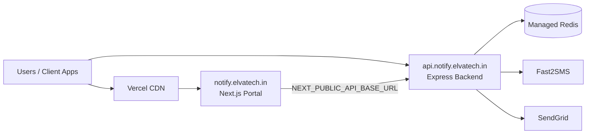

- **Portal:** `https://notify.elvatech.in` — Vercel, root directory `frontend/`
- **API:** `https://api.notify.elvatech.in` — deployed externally (not defined in repo)
- **No Docker, Kubernetes, Terraform, or CI/CD** in repository as of audit date

---

# SECTION 3: COMPLETE REQUEST FLOW

## Supported Channels

| Channel | Supported | Provider | Notes |
|---------|-----------|----------|-------|
| **SMS** | Yes | Fast2SMS | Legacy (`route=q`) and DLT (`route=dlt`) |
| **Email** | Yes | SendGrid | HTML or basic template mode |
| **WhatsApp** | No | — | Listed as future in roadmap docs |
| **Push Notifications** | No | — | Not implemented |

---

## 3.1 SMS — OTP Send Flow (DLT Path)

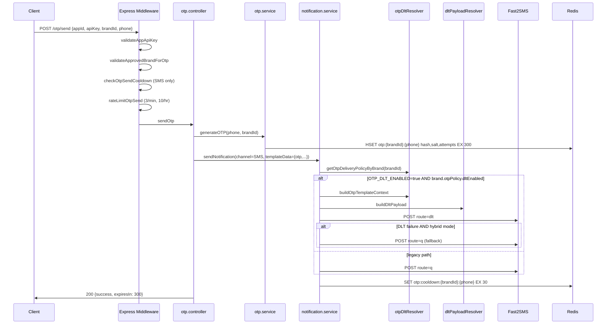

**Step-by-step:**

1. **Request enters** — `POST /otp/send` with JSON body.
2. **Validation** — `assertSendOtpBodyValid`: `appId`, `brandId`, `phone`/`email`, channel normalization.
3. **Authentication** — `validateAppApiKey`: body `appId` + `apiKey` vs `APP_CREDENTIALS_JSON`.
4. **Brand gate** — `validateApprovedBrandForOtp`: brand must be `active` in brand registry.
5. **Cooldown** — `checkOtpSendCooldown`: blocks if `otp:cooldown:{brandId}:{phone}` exists (30s).
6. **Rate limit** — `rateLimitOtpSend`: 3/min, 10/hr per phone via Redis counters.
7. **OTP generation** — `otp.service.generateOTP`: 6-digit code, scrypt hash + random salt → Redis TTL 300s.
8. **Template resolution** — `resolveOtpTemplateByBrand` → `LOGIN_OTP` (or brand-configured key); optional `loginId`, `businessName` from body.
9. **Variable substitution** — `buildOtpTemplateContext`: `{businessName, otp}` → pipe-joined `variables_values` for Fast2SMS.
10. **Queueing** — None (synchronous).
11. **Provider dispatch** — `notification.service.sendOtpSmsToRecipients` → `fast2sms.sendDltSMS` or `sendSMS`.
12. **Delivery tracking** — Structured logs: `otp_dlt_dispatch`, `provider_response`, `otp_delivery_completed`. No webhook DLR.
13. **Failure handling** — On provider failure: `otp.service.revokeOTP`, return **502** `sms_failed`. Hybrid brands fall back to route `q`; DLT-only brands hard-fail.

---

## 3.2 SMS — OTP Verify Flow

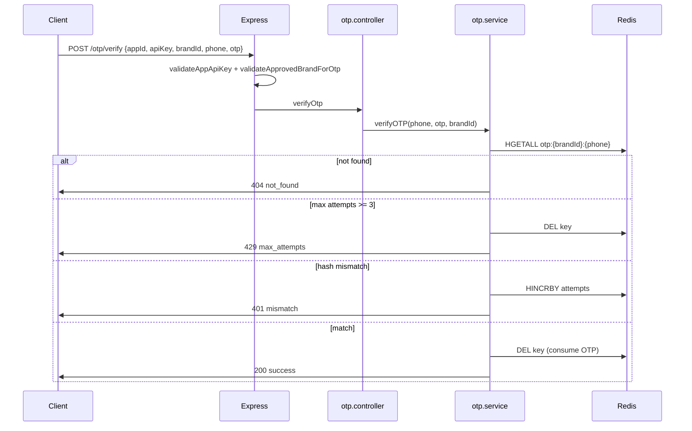

---

## 3.3 SMS — Notify (DLT Template) Flow

Applies to transactional templates: `ORDER_PLACED`, `ORDER_DELIVERED`, `OUT_FOR_DELIVERY`.

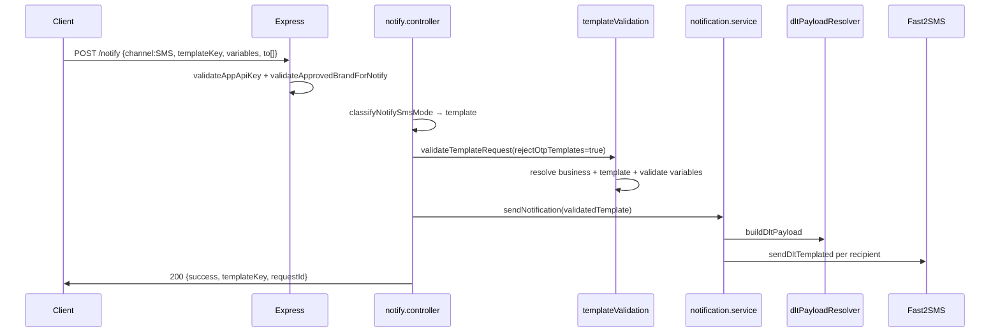

**Brand resolution for notify SMS:**
- Explicit `brandId` in body, OR
- `variables.businessName` matched against registry `brandName` (case-insensitive)

**Template allowlist:** Brand's `templates.notify` array must include the `templateKey`.

---

## 3.4 SMS — Notify (Legacy Free-Text) Flow

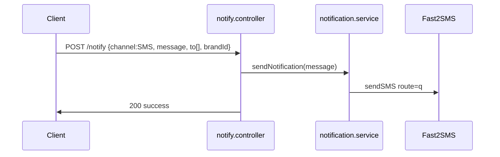

Legacy SMS still requires an approved brand for SMS channel (brand gate middleware).

---

## 3.5 Email — OTP Flow

1. Client sends `channel: "EMAIL"` + `email` on `/otp/send`.
2. Same auth, brand gate, OTP generation as SMS (no SMS cooldown/rate limit on email path for cooldown middleware — cooldown only applied when `channel === 'SMS'` after successful send).
3. `notification.service.handleEmail` → `emailTemplates.getOtpTemplate` builds inline HTML.
4. `email.service.sendEmail` → SendGrid.

---

## 3.6 Email — Notify Flow

Two modes:

| Mode | Required Fields | Rendering |
|------|-----------------|-----------|
| **HTML** | `subject`, `html` | Raw HTML passed to SendGrid |
| **Template** | `subject`, `template`, optional `data` | `buildTemplateHtml`: `<h2>{subject}</h2><p>{JSON.stringify(data)}</p>` |

Email notify is **not brand-gated** (middleware skips brand validation when channel ≠ SMS).

---

## 3.7 WhatsApp / Push

**Not implemented.** `backend/src/config/channels.js` defines `SUPPORTED_CHANNELS = ['EMAIL', 'SMS']` only.

---

# SECTION 4: SOURCE CODE STRUCTURE

## Repository Layout

```
elva-notify-platform/
├── backend/                    # Express API (elva-otp-service)
│   ├── src/
│   │   ├── server.js           # HTTP entry, Redis lifecycle, graceful shutdown
│   │   ├── app.js              # Express app, middleware, static ops UI
│   │   ├── routes/             # Route definitions
│   │   ├── controllers/        # Request handlers
│   │   ├── middleware/         # Auth, rate limits, brand gate
│   │   ├── services/           # Business logic
│   │   ├── businesses/         # Business module loader + registry
│   │   ├── config/             # env.js, allowedApps.js, channels.js
│   │   └── utils/              # phone, email, otpCrypto, brandId, appId
│   ├── config/
│   │   ├── businesses/         # Per-business JSON (apnakart, enandi, workspace)
│   │   ├── tenants/            # brand-registry.json, brand-requests.json
│   │   ├── otp-mappings.json   # Legacy appId → business mapping
│   │   └── templates/          # JSON schema templates for new configs
│   ├── openapi/                # OpenAPI 3.1 spec
│   ├── public/                 # Legacy ops HTML viewers
│   ├── scripts/                # Manual validation/test scripts
│   └── .generated/             # Startup health snapshots
├── frontend/                   # Next.js docs portal
│   ├── app/                    # App Router pages
│   ├── components/             # UI components
│   ├── lib/                    # API clients, config, manifest loaders
│   └── scripts/                # Build-time manifest generators
├── docs/                       # Markdown documentation source
└── package.json                # Root orchestrator (concurrently dev)
```

## Entry Points

| File | Purpose | Dependencies | Consumers |
|------|---------|--------------|-----------|
| `backend/src/server.js` | Creates HTTP server, connects Redis, SIGTERM/SIGINT shutdown | `app.js`, `redis.service`, `env.js` | `npm start`, `npm run dev` |
| `backend/src/app.js` | Express middleware stack, route mounting, static files | All routes, middleware, `businesses/index.js` | `server.js` |
| `frontend/app/layout.tsx` | Root layout for docs portal | Next.js, Tailwind | All frontend pages |

## Critical Backend Files

### Routes (`backend/src/routes/`)

| File | Mounts | Purpose |
|------|--------|---------|
| `index.js` | `/` | Aggregates all route modules |
| `health.routes.js` | `/health`, `/otp` | Health check + OTP sub-router |
| `otp.routes.js` | `/otp/*` | Send, resend, verify with middleware chain |
| `notify.routes.js` | `/notify` | Unified notification endpoint |
| `platform.routes.js` | `/platform/*` | Read-only metadata for dashboard |
| `integration.routes.js` | `/integrations/*` | Brand onboarding workflow |
| `ops.routes.js` | `/ops/*` | Log viewer, business list |

### Controllers (`backend/src/controllers/`)

| File | Key Functions | Purpose |
|------|---------------|---------|
| `otp.controller.js` | `sendOtp`, `resendOtp`, `verifyOtp`, `sendOtpImpl` | OTP HTTP handling, validation, provider rollback |
| `notify.controller.js` | `handleNotify` | SMS/email notify, template vs legacy mode routing |
| `health.controller.js` | `getHealth`, `headHealth` | Uptime + optional `otpDlt` snapshot |
| `platform.controller.js` | `listBusinessesHandler`, etc. | Portal metadata API |
| `integration.controller.js` | `submitRequest`, `approveRequestAdmin` | Brand onboarding |
| `ops.controller.js` | `getLogs`, `getBusinesses` | Ops debugging |

### Core Services (`backend/src/services/`)

| File | Exports | Purpose | Consumers |
|------|---------|---------|-----------|
| `otp.service.js` | `generateOTP`, `verifyOTP`, `revokeOTP` | OTP crypto + Redis lifecycle | `otp.controller.js` |
| `notification.service.js` | `sendNotification` | Channel routing, DLT/legacy OTP SMS, email | `otp.controller.js`, `notify.controller.js` |
| `dltPayloadResolver.service.js` | `buildDltPayload` | Assembles Fast2SMS DLT payload | `notification.service.js` |
| `otpDltResolver.service.js` | `getOtpDeliveryPolicyByBrand`, `buildOtpTemplateContext` | Brand DLT policy + OTP template context | `notification.service.js`, `otp.controller.js` |
| `templateValidation/templateValidation.service.js` | `validateTemplateRequest` | Business/template/variable validation | `notify.controller.js` |
| `brandRegistry.service.js` | `getBrand`, `upsertActiveBrand`, `resolveBrandFromNotifyBody` | Tenant brand registry CRUD | Middleware, platform, integration |
| `brandRequest.service.js` | `createBrandRequest`, `approveBrandRequest` | Onboarding request lifecycle | `integration.controller.js` |
| `redis.service.js` | `connectRedis`, `otpKey`, hash ops | Redis client singleton | OTP, rate limits, cooldowns |
| `sms/sms.service.js` | `sendOTP`, `sendMessage`, `sendDltTemplated` | SMS abstraction | `notification.service.js` |
| `sms/providers/fast2sms.js` | `sendSMS`, `sendDltSMS` | Fast2SMS HTTP client | `sms.service.js` |
| `email/email.service.js` | `sendEmail` | SendGrid wrapper | `notification.service.js`, brand notifications |
| `logging/businessLogger.service.js` | `logOtp`, `logDlt`, `logNotification`, etc. | Structured logging facade | All services |
| `logBuffer.service.js` | `append`, `getLogs` | In-memory ring buffer (1000 entries) | Logger, ops viewer |

### Middleware (`backend/src/middleware/`)

| File | Function | Purpose |
|------|----------|---------|
| `requestId.js` | `requestId` | UUID per request, `X-Request-Id` header |
| `validateAppApiKey.js` | `validateAppApiKey` | Body-based API key auth |
| `validateApprovedBrand.js` | `validateApprovedBrandForOtp`, `validateApprovedBrandForNotify` | Brand registry gate |
| `checkOtpSendCooldown.js` | `checkOtpSendCooldown` | 30s post-send SMS cooldown |
| `rateLimitOtpSend.js` | `rateLimitOtpSend` | 3/min, 10/hr per phone |
| `rateLimiter.js` | `rateLimiter` | Global 10/min per appId |
| `requireOpsAdmin.js` | `requireOpsAdmin` | Admin token for integration approvals |

### Business Modules (`backend/src/businesses/`)

| File | Purpose |
|------|---------|
| `index.js` | Startup bootstrap: load configs, validate, write health snapshots |
| `configLoader.js` | Loads `config/businesses/*` directories |
| `registry.js` | In-memory `getBusiness`, `getTemplate`, `listBusinesses` |
| `schemaValidator.js` | Validates `business.json` + `templates.json` schemas |
| `apnakart/config.js` | Code-based ApnaKart module (legacy, coexists with JSON) |

### Frontend Key Files

| File | Purpose |
|------|---------|
| `frontend/lib/config.ts` | `API_BASE_URL` from `NEXT_PUBLIC_API_BASE_URL` |
| `frontend/lib/platform-api.ts` | Platform dashboard API client |
| `frontend/lib/integration-api.ts` | Onboarding + admin API client |
| `frontend/lib/openapi-loader.ts` | OpenAPI manifest loader for API reference |
| `frontend/lib/nav.config.ts` | Docs navigation structure |
| `frontend/components/playground/api-endpoint-tester.tsx` | Interactive API tester |

---

# SECTION 5: API DOCUMENTATION

## Authentication Model

All protected endpoints require **`appId` + `apiKey` in the JSON request body** (not headers). OTP and SMS notify additionally require **`brandId`** (or brand resolution via `variables.businessName`).

Admin integration endpoints require header **`X-Ops-Admin-Token`** or **`Authorization: Bearer {OPS_ADMIN_TOKEN}`**.

---

## 5.1 Health

| Endpoint | Method | Auth | Description |
|----------|--------|------|-------------|
| `/health` | GET | None | Service health + optional `otpDlt` snapshot |
| `/health` | HEAD | None | Same availability, no body |

**Response (200):**
```json
{
  "status": "ok",
  "service": "elva-otp-service",
  "timestamp": "2026-06-21T00:00:00.000Z",
  "requestId": "uuid",
  "otpDlt": { }
}
```

---

## 5.2 OTP Endpoints

### POST /otp/send

| Field | Type | Required | Validation |
|-------|------|----------|------------|
| `appId` | string | Yes | Must exist in `APP_CREDENTIALS_JSON` |
| `apiKey` | string | Yes | Must match configured secret |
| `brandId` | string | Yes | Pattern `^[a-z0-9_-]{2,32}$`, active in registry |
| `phone` | string | Yes (SMS) | Normalized to digits |
| `email` | string | Yes (EMAIL) | Valid email format |
| `channel` | string | No | `SMS` (default) or `EMAIL` |
| `loginId` | string | No | For `LOGIN_OTP_WITH_ID` template |
| `businessName` | string | No | Override DLT display name |

**Middleware chain:** `validateAppApiKey` → `validateApprovedBrandForOtp` → `checkOtpSendCooldown` → `rateLimitOtpSend` → global rate limit

**Success (200):**
```json
{ "success": true, "message": "OTP sent successfully", "expiresIn": 300, "requestId": "uuid" }
```

**Key errors:** 401 unauthorized, 403 forbidden/brand_not_approved, 429 rate_limited/cooldown, 502 sms_failed

**Internal flow:** `otp.controller.sendOtp` → `otp.service.generateOTP` → `notification.service.sendNotification`

---

### POST /otp/resend

Same request/response as send. Revokes existing OTP first via `otp.service.revokeOTP`.

---

### POST /otp/verify

| Field | Type | Required |
|-------|------|----------|
| `appId`, `apiKey`, `brandId` | string | Yes |
| `phone` OR `email` | string | One required |
| `otp` | string | Yes, exactly 6 digits |

**Verify outcome mapping:**

| reason | HTTP | error code |
|--------|------|------------|
| success | 200 | — |
| mismatch | 401 | mismatch |
| not_found | 404 | not_found |
| expired | 410 | expired |
| max_attempts | 429 | max_attempts |
| invalid_otp_format | 400 | invalid_otp_format |

---

## 5.3 POST /notify

### Mode: Legacy SMS

| Field | Required |
|-------|----------|
| `channel: "SMS"`, `to[]`, `message` | Yes |
| `brandId` | Required (brand gate) |

### Mode: DLT Template SMS

| Field | Required |
|-------|----------|
| `channel: "SMS"`, `to[]`, `templateKey`, `variables` | Yes |
| `brandId` OR `variables.businessName` | Required |

**Blocked templates on notify:** `LOGIN_OTP`, `LOGIN_OTP_WITH_ID` → 400 `otp_template_not_supported`

### Mode: Email HTML

| Field | Required |
|-------|----------|
| `channel: "EMAIL"`, `to[]`, `subject`, `html` | Yes |

### Mode: Email Template

| Field | Required |
|-------|----------|
| `channel: "EMAIL"`, `to[]`, `subject`, `template` | Yes |
| `data` | Optional object |

**Success (200):**
```json
{ "success": true, "message": "Notification sent", "channel": "SMS", "requestId": "uuid" }
```

---

## 5.4 Platform Metadata (Unauthenticated, Rate-Limit Exempt)

| Endpoint | Method | Purpose |
|----------|--------|---------|
| `GET /platform/businesses` | GET | List business modules |
| `GET /platform/businesses/:businessId` | GET | Business detail |
| `GET /platform/businesses/:businessId/templates` | GET | Template catalog |
| `GET /platform/businesses/:businessId/templates/:templateKey` | GET | Single template |
| `GET /platform/otp` | GET | OTP DLT rollout metadata |
| `GET /platform/brands` | GET | Active brand list |

---

## 5.5 Integrations / Onboarding

| Endpoint | Method | Auth | Purpose |
|----------|--------|------|---------|
| `GET /integrations/catalog` | GET | None | Available templates for onboarding |
| `POST /integrations/requests` | POST | None | Submit brand access request |
| `GET /integrations/requests/:requestId` | GET | None | Public request status |
| `GET /integrations/admin/session` | GET | Ops admin | Verify admin session |
| `GET /integrations/admin/requests` | GET | Ops admin | List all requests |
| `GET /integrations/admin/requests/:requestId` | GET | Ops admin | Request detail |
| `POST /integrations/admin/requests/:requestId/approve` | POST | Ops admin | Approve → activate brand |
| `POST /integrations/admin/requests/:requestId/reject` | POST | Ops admin | Reject request |

---

## 5.6 Ops

| Endpoint | Method | Auth | Purpose |
|----------|--------|------|---------|
| `GET /ops/logs` | GET | None | In-memory log buffer |
| `GET /ops/businesses` | GET | None | Business list for ops UI |

**Query params for `/ops/logs`:** `?business=`, `?limit=`, `?since=`, `?format=raw|ndjson`

---

# SECTION 6: DATABASE DOCUMENTATION

## Storage Architecture

ELVA Notify uses **no relational or document database**. Persistence is split between:

1. **Redis** — ephemeral OTP state, rate limits, cooldowns
2. **JSON files** — tenant config, templates, onboarding requests
3. **In-memory** — log ring buffer (lost on restart)

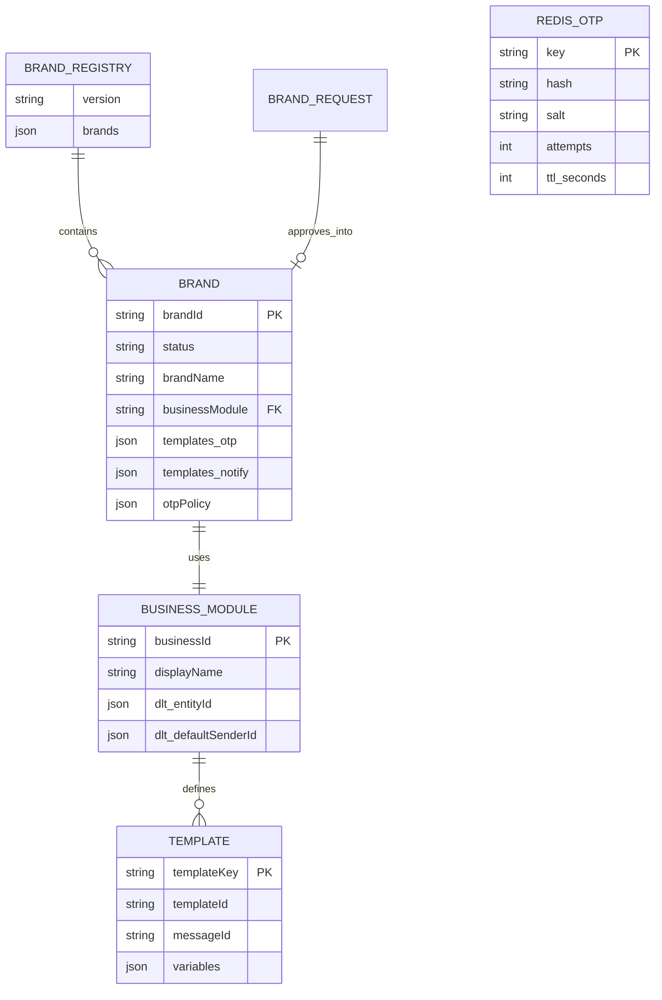

---

## Redis Key Schema

| Key Pattern | Type | TTL | Fields / Value | Purpose |
|-------------|------|-----|----------------|---------|
| `otp:{brandId}:{recipient}` | Hash | 300s | `hash`, `salt`, `attempts` | OTP verification state |
| `otp:cooldown:{brandId}:{phone}` | String | 30s | `"1"` | Post-send SMS cooldown |
| `otp:rate:{phone}:minute` | Counter | 60s | integer | Send rate: max 3/min |
| `otp:rate:{phone}:hour` | Counter | 3600s | integer | Send rate: max 10/hr |

**OTP hash algorithm:** scrypt with random 16-byte salt, stored as hex strings. Verification uses timing-safe `digestsEqual`.

**Recipient normalization:**
- Phone → digits only via `normalizePhone`
- Email → lowercase trimmed via `normalizeEmail`
- Redis key uses `brandId` + recipient (NOT `appId`)

---

## JSON Configuration Files

### `backend/config/tenants/brand-registry.json`

| Field (per brand) | Type | Constraints |
|-------------------|------|-------------|
| `status` | enum | `active`, `suspended`, `pending` |
| `brandName` | string | Display name for DLT variables |
| `businessModule` | string | e.g. `"apnakart"` |
| `templates.otp` | string[] | Allowed OTP template keys |
| `templates.notify` | string[] | Allowed notify template keys |
| `otpPolicy.templateKey` | string | Default OTP template |
| `otpPolicy.dltEnabled` | boolean | Per-brand DLT switch |
| `otpPolicy.legacyRouteEnabled` | boolean | Allow route `q` fallback |

### `backend/config/businesses/apnakart/templates.json`

Each template entry:

| Field | Type | Purpose |
|-------|------|---------|
| `templateKey` | string | API identifier |
| `purpose` | string | Human description |
| `templateId` | string | DLT template ID (TRAI registry) |
| `messageId` | string | Fast2SMS message ID |
| `variables[]` | array | Schema: name, position, type, length, pattern |

### `backend/config/businesses/apnakart/business.json`

| Field | Value (production) |
|-------|-------------------|
| `dlt.entityId` | `1201177860312735154` (PEID) |
| `dlt.defaultSenderId` | `ELVATK` |

### `backend/config/tenants/brand-requests.json`

Onboarding requests with status lifecycle: `pending` → `approved` / `rejected`.

### `backend/config/otp-mappings.json` (Legacy)

Maps legacy `appId` → `{business, templateKey, dltEnabled, legacyRouteEnabled}`. Still validated at startup; superseded by brand registry for new integrations.

---

## Indexes

**Redis:** No explicit indexes — direct key lookup by constructed key string.

**JSON files:** Linear scan in memory after startup load. No indexing layer.

---

# SECTION 7: TEMPLATE ENGINE

## Storage

Templates are stored as **JSON files** per business module:

- Primary catalog: `backend/config/businesses/apnakart/templates.json`
- Schema templates for new businesses: `backend/config/templates/*.template.json`
- Code mirror (legacy): `backend/src/businesses/apnakart/templates.js`

There is **no database-backed template store** and **no external template engine** (Handlebars, EJS, etc.).

## Resolution Flow

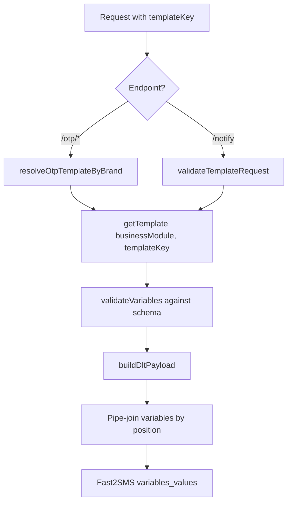

## Variable Replacement Mechanism

1. Template defines variables with `position` (1-indexed ordering for DLT).
2. `variableValidator.js` validates type (`numeric`, `string`, `date`, `datetime`, `time`), `length`, `maxLength`, `pattern`, `digitsOnly`.
3. `buildVariablesValues` sorts by position, maps each variable name to string value, joins with `|`.
4. Example for `LOGIN_OTP`: `"eNandi|482910"` → `{businessName}|{otp}`

## OTP Template Variable Defaults

- `otp` — generated by service, never client-supplied on `/otp/send`
- `businessName` — defaults to registry `brandName` if not overridden in request body
- `loginId` — optional body field for `LOGIN_OTP_WITH_ID`

## Fallback Behavior

| Scenario | Behavior |
|----------|----------|
| DLT metadata missing | `TemplateValidationError` code `dlt_metadata_missing` |
| Variable missing | `missing_variable` |
| OTP template on `/notify` | `otp_template_not_supported` |
| DLT send failure (hybrid brand) | Fallback to legacy route `q` with free-text OTP message |
| DLT send failure (DLT-only brand) | Hard fail, OTP revoked |

## Validation Examples

**Valid ORDER_PLACED request:**
```json
{
  "templateKey": "ORDER_PLACED",
  "variables": {
    "customerName": "Arun",
    "businessName": "eNandi",
    "orderId": "ORD-2026-001"
  }
}
```

**Invalid — OTP on notify (rejected):**
```json
{
  "templateKey": "LOGIN_OTP",
  "variables": { "businessName": "eNandi", "otp": "123456" }
}
```

---

# SECTION 8: DLT INTEGRATION (IMPORTANT)

## Overview

DLT (Distributed Ledger Technology — India telecom template registry) compliance is enforced server-side. Clients send **template keys + variables**; the server resolves DLT IDs and calls Fast2SMS `route=dlt`.

## DLT Provider

**Single SMS provider: Fast2SMS**

- API: `POST https://www.fast2sms.com/dev/bulkV2`
- DLT route payload fields: `route`, `sender_id`, `message` (messageId), `variables_values`, `entity_id`, `numbers`

## Template Registration (Server-Side)

Templates are pre-registered with TRAI/DLT and configured in JSON:

| templateKey | DLT templateId | Fast2SMS messageId | Purpose |
|-------------|----------------|-------------------|---------|
| `LOGIN_OTP` | `1207177979441360359` | `216423` | OTP login |
| `LOGIN_OTP_WITH_ID` | `1207177979905330405` | `216426` | OTP with loginId |
| `ORDER_PLACED` | `1207177979197056177` | `216424` | Order confirmation |
| `ORDER_DELIVERED` | `1207177979979637116` | `216425` | Delivery confirmation |
| `OUT_FOR_DELIVERY` | `1207177987065122467` | `216427` | Out for delivery |

## Entity IDs (PEID)

Resolution order in `dltPayloadResolver.service.js`:

1. Template-level `dlt.entityId` (if present)
2. Business-level `dlt.entityId` → **`1201177860312735154`** (ApnaKart)
3. Environment `FAST2SMS_ENTITY_ID`

## Template IDs

Resolved from template JSON `templateId` field (DLT registry ID). Not overridable at runtime by clients.

## Header Management (Sender ID)

Resolution order:

1. Template-level `dlt.senderId`
2. Business `dlt.defaultSenderId` → **`ELVATK`**
3. Environment `FAST2SMS_DEFAULT_SENDER_ID`

## Consent Management

**Not implemented in code.** DLT consent/opt-in is assumed handled at TRAI registration and client application level. The service validates template allowlists and brand approval only.

## Validation Logic

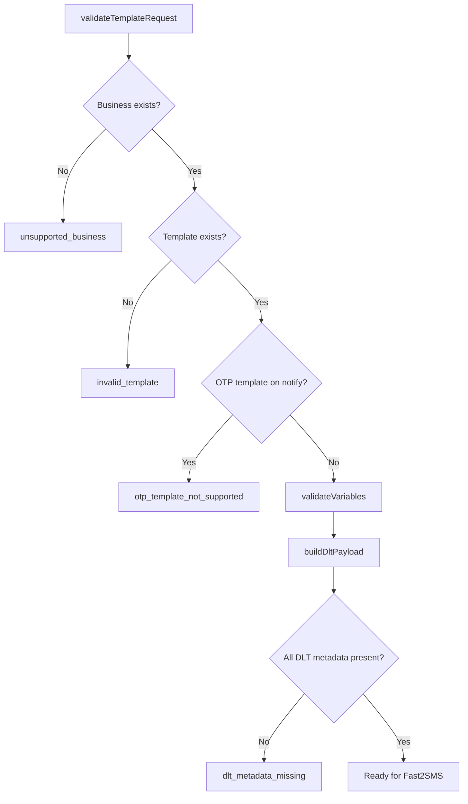

## OTP DLT Activation Conditions

Both must be true:

1. Global: `OTP_DLT_ENABLED=true`
2. Per-brand: `otpPolicy.dltEnabled: true` in brand registry

## Delivery Policies

| Policy | Condition | On DLT Failure |
|--------|-----------|----------------|
| `legacy_q` | DLT inactive | Always route `q` |
| `hybrid` | DLT active + `legacyRouteEnabled: true` | Fallback to route `q` |
| `dlt_only` | DLT active + `legacyRouteEnabled: false` | Hard fail, no fallback |

## Failure Handling

| Event | Log Event | HTTP Response |
|-------|-----------|---------------|
| DLT metadata incomplete | `template_validation_failed` | 400 |
| Fast2SMS rejects DLT | `fast2sms_dlt_rejected`, `provider_response_failed` | 502 (OTP) / 500 (notify) |
| DLT failure + hybrid | `otp_dlt_fallback` → route `q` retry | 200 if fallback succeeds |
| DLT failure + dlt_only | `otp_dlt_hard_failure` | 502, OTP revoked |

## Complete DLT Flow (Code Path)

```
notify.controller / otp.controller
  → templateValidation.service.validateTemplateRequest (notify only)
  → otpDltResolver.buildOtpTemplateContext (OTP SMS only)
  → dltPayloadResolver.buildDltPayload
  → sms.service.sendDltTemplated
  → fast2sms.sendDltSMS
  → fetch POST bulkV2 {route: "dlt", ...}
```

---

# SECTION 9: SMS DELIVERY PIPELINE

## Provider Integrations

| Provider | Status | Routes | File |
|----------|--------|--------|------|
| **Fast2SMS** | Active (only provider) | `q` (legacy), `dlt` (templated) | `fast2sms.js` |
| MSG91 | Not integrated | Comment placeholder in `sms.service.js` | — |
| Gupshup | Not integrated | — | — |

## Provider Selection Logic

There is **no multi-provider routing**. All SMS goes through Fast2SMS.

Route selection:

| Condition | Route | Function |
|-----------|-------|----------|
| Legacy OTP or free-text notify | `q` | `sendSMS` |
| DLT templated (OTP or notify) | `dlt` | `sendDltSMS` |
| OTP DLT failure + hybrid brand | `q` (fallback) | `sendLegacyOtpToRecipients` |

## Routing Logic (OTP)

Determined by `getOtpDeliveryPolicyByBrand(brandId)` in `otpDltResolver.service.js`.

## Retry Logic

**No automatic retries.** Single HTTP call to Fast2SMS per recipient. Hybrid mode performs one fallback attempt to route `q` on DLT failure.

## Failover Logic

Only OTP hybrid brands (`legacyRouteEnabled: true`, e.g. `cms`) get DLT → legacy failover. Notify DLT SMS has **no failover** — failure returns 500.

## Rate Limiting

| Layer | Limit | Scope |
|-------|-------|-------|
| Global | 10 req/min | appId → apiKey → IP fallback |
| OTP send | 3/min, 10/hr | Per normalized phone |
| Cooldown | 30s block | Per brandId + phone after successful SMS send |

## Delivery Reports

**Not implemented.** Fast2SMS response is logged (`provider_response`) but there is no webhook/callback handler for delivery status updates. Final status is **provider accept/reject at request time only**.

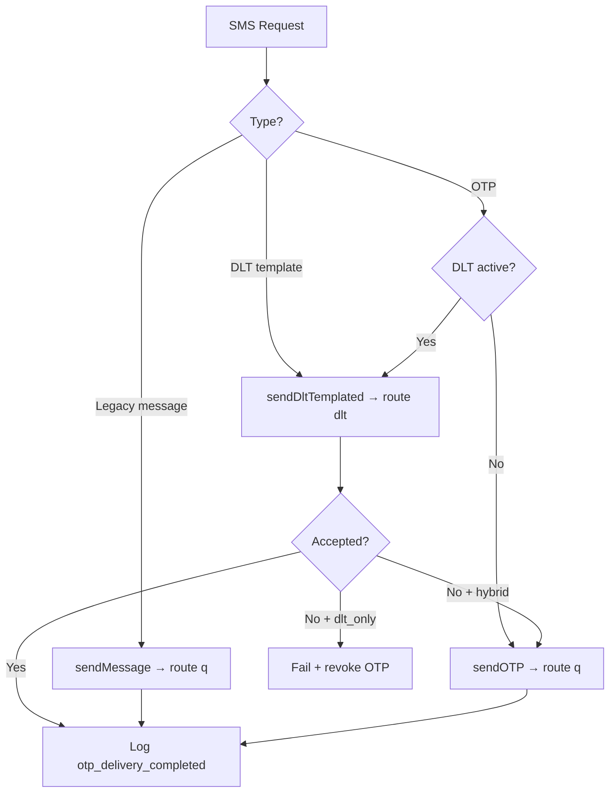

---

# SECTION 10: EMAIL DELIVERY PIPELINE

## Email Provider

**SendGrid only** via `@sendgrid/mail`.

| Provider | Status |
|----------|--------|
| SendGrid | Active |
| AWS SES | Not integrated |
| Mailgun | Not integrated |
| SMTP direct | Not integrated |

## Configuration

| Env Var | Purpose |
|---------|---------|
| `SENDGRID_API_KEY` | API authentication |
| `EMAIL_FROM` | From address for all sends |

## Template Rendering

| Use Case | Renderer | Output |
|----------|----------|--------|
| OTP email | `emailTemplates.getOtpTemplate` | Inline HTML with OTP code |
| Notify HTML mode | Client-supplied | Raw HTML to SendGrid |
| Notify template mode | `buildTemplateHtml` | `<h2>{subject}</h2><p>{JSON.stringify(data)}</p>` |
| Brand onboarding | `brandRequestNotification.service` | SendGrid transactional emails |

## Attachments

**Not supported.** `sendEmail` accepts `{to, subject, html}` only.

## Tracking

**Not implemented.** No open/click tracking, no SendGrid event webhooks configured in code.

## Email Flow

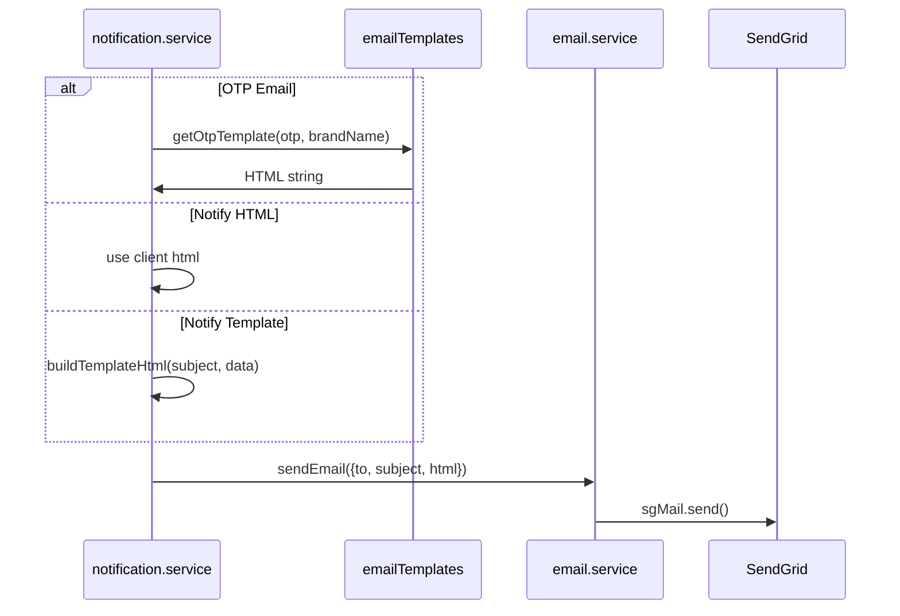

---

# SECTION 11: AUTHENTICATION & AUTHORIZATION

## Authentication Mechanisms

| Mechanism | Used | Details |
|-----------|------|---------|
| **API Keys (body)** | Yes | `appId` + `apiKey` in JSON body |
| **JWT** | No | — |
| **OAuth** | No | — |
| **Session cookies** | No | — |
| **Ops Admin Token** | Yes | Header for integration admin routes |

## API Key Configuration

```json
// APP_CREDENTIALS_JSON environment variable
{"ELVA_NOTIFY": "shared-platform-api-key", "eNandi": "client-secret"}
```

Loaded by `backend/src/config/allowedApps.js`. `appId` must not contain `:` (validated by `normalizeAppId`).

## Brand Authorization (RBAC-lite)

Not role-based in the traditional sense. Authorization layers:

1. **Platform credential** — valid `appId`/`apiKey` pair
2. **Brand approval** — brand must be `active` in registry
3. **Template allowlist** — notify SMS templates must be in brand's `templates.notify`
4. **Ops admin** — `OPS_ADMIN_TOKEN` for approval endpoints

## Permission Model

| Resource | Gate | Error Code |
|----------|------|------------|
| OTP endpoints | Active brand + OTP templates enabled | `brand_not_approved`, `brand_suspended` |
| Notify SMS | Active brand + template allowlist | `template_not_allowed` |
| Notify EMAIL | API key only | — |
| Platform GET | None | — |
| Integration admin | Ops token | 401 |

## Security Flow

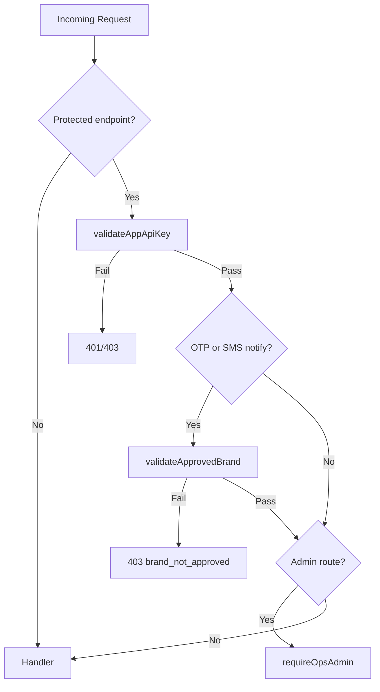

---

# SECTION 12: CONFIGURATION MANAGEMENT

## Environment Variables

| Variable | Required | Default | Purpose |
|----------|----------|---------|---------|
| `PORT` | No | `3000` (`.env.example`: 4000) | HTTP server port |
| `NODE_ENV` | No | `development` | Runtime environment |
| `APP_CREDENTIALS_JSON` | **Yes** | — | JSON map appId → apiKey |
| `REDIS_URL` | No* | — | Redis connection URL (preferred) |
| `REDIS_HOST` | No | `127.0.0.1` | Redis host if no URL |
| `REDIS_PORT` | No | `6379` | Redis port |
| `REDIS_USERNAME` | No | — | Redis ACL username |
| `REDIS_PASSWORD` | No | — | Redis password |
| `REDIS_TLS` | No | `false` | Enable TLS |
| `REDIS_DB` | No | — | Redis database number |
| `FAST2SMS_API_KEY` | **Yes** (SMS) | — | Fast2SMS authorization |
| `FAST2SMS_ENTITY_ID` | No | — | DLT PEID fallback |
| `FAST2SMS_DEFAULT_SENDER_ID` | No | — | Sender header fallback |
| `SENDGRID_API_KEY` | **Yes** (EMAIL) | — | SendGrid API key |
| `EMAIL_FROM` | **Yes** (EMAIL) | — | From email address |
| `OTP_DLT_ENABLED` | No | `false` | Global OTP DLT master switch |
| `OPS_ADMIN_TOKEN` | No | — | Admin token for approvals |
| `ADMIN_NOTIFY_EMAIL` | No | — | Email for new request notifications |
| `PLATFORM_PUBLIC_URL` | No | `http://localhost:3000` | Links in approval emails |
| `INTEGRATION_APP_ID` | No | — | Preferred appId in approval emails |

*Redis is required at runtime for OTP; connection fails on startup if unavailable.

## Frontend Environment

| Variable | Required | Default | Purpose |
|----------|----------|---------|---------|
| `NEXT_PUBLIC_API_BASE_URL` | No | `http://localhost:4000` | Backend API URL |
| `NEXT_PUBLIC_BASE_PATH` | No | — | Subpath mounting |
| `NEXT_STANDALONE` | No | — | Enable standalone Next.js output |

## Config Files

| Path | Purpose | Hot Reload |
|------|---------|------------|
| `backend/config/tenants/brand-registry.json` | Active brands | No — restart required |
| `backend/config/tenants/brand-requests.json` | Onboarding queue | Written at runtime on approve |
| `backend/config/businesses/*/business.json` | Business DLT metadata | No — startup load |
| `backend/config/businesses/*/templates.json` | Template catalog | No — startup load |
| `backend/config/otp-mappings.json` | Legacy appId mapping | No — startup load |
| `backend/.env` | Secrets and runtime config | Restart required |

## Secrets Management

Secrets are **environment variables only**. No Vault, AWS Secrets Manager, or encrypted config. `.env` files are gitignored; `.env.example` provides templates.

---

# SECTION 13: MESSAGE LIFECYCLE

## OTP SMS Lifecycle State Machine

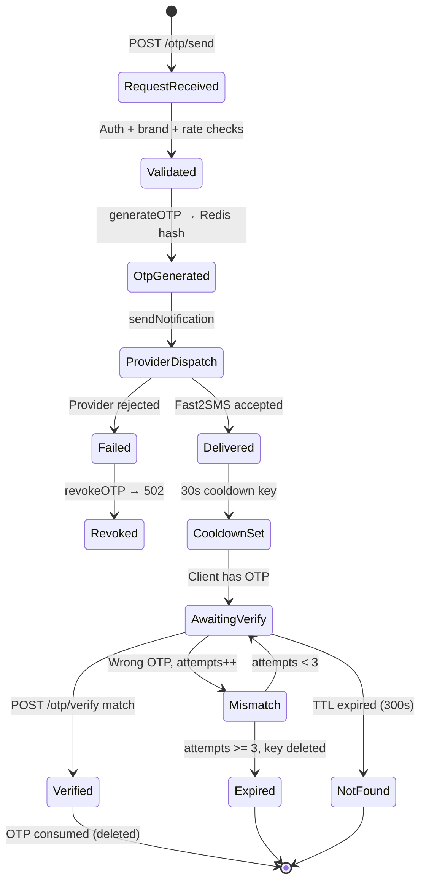

## State Transitions (Detailed)

| Stage | Action | Storage Effect | Log Event |
|-------|--------|----------------|-------------|
| **Create Request** | Client POST | — | — |
| **Validation** | Middleware + controller | — | — |
| **OTP Generate** | scrypt hash + salt | `HSET otp:{brand}:{recipient}` TTL 300 | `otp_generated` |
| **Queue** | N/A (sync) | — | — |
| **Processing** | Template resolve + DLT payload | — | `otp_dlt_dispatch` |
| **Provider** | Fast2SMS HTTP | — | `provider_response` |
| **Callback** | N/A (no webhooks) | — | — |
| **Delivery Report** | Provider response parsed | — | `otp_delivery_completed` |
| **Final Status** | 200 success / 502 fail | Cooldown set or OTP revoked | `otp_notification_sent` / `otp_notification_failed` |

## Notify SMS Lifecycle

Similar but **no Redis state**. Single synchronous provider call. Success/failure determined immediately from Fast2SMS HTTP response.

---

# SECTION 14: BACKGROUND JOBS

## Summary

**No cron jobs, workers, schedulers, or queue consumers exist.**

| Expected Component | Status |
|--------------------|--------|
| Cron jobs | None |
| Bull/Bee/SQS workers | None |
| Scheduled cleanup | Redis TTL handles OTP expiry automatically |
| Retry tasks | None (inline fallback only for hybrid OTP) |

## Startup Tasks (Not Scheduled)

Executed once at process boot via `backend/src/businesses/index.js`:

| Task | Output |
|------|--------|
| `writeOtpHealthSnapshot('startup')` | `backend/.generated/otp-health-snapshot.json` |
| `writeBusinessHealthSnapshot('startup')` | `backend/.generated/business-health-snapshot.json` |
| Business config validation | Throws on invalid config (fail-fast) |
| Brand registry validation | Throws on invalid registry |

## Manual Scripts (`backend/scripts/`)

| Script | Purpose | Schedule |
|--------|---------|----------|
| `generate-otp-health-snapshot.mjs` | DLT health metrics | Manual (`npm run otp:health`) |
| `generate-business-health-snapshot.mjs` | Config audit | Manual |
| `validate-brand-registry.mjs` | Registry validation | Manual |
| `verify-fast2sms-dlt-rejection.js` | DLT rejection testing | Manual |

---

# SECTION 15: ERROR HANDLING

## Exception Handling

| Layer | Handler | Behavior |
|-------|---------|----------|
| Controllers | try/catch + `next(err)` | Structured JSON error responses |
| Global | `app.js` error middleware | 500 `internal_error` + `requestId` |
| Services | Throw with `providerFailure` attachment | Propagated to controllers |
| Template validation | `TemplateValidationError` with `code` | Mapped to 400 responses |

## Retry Policies

| Operation | Retries |
|-----------|---------|
| Fast2SMS HTTP | 0 (single attempt) |
| OTP DLT → legacy fallback | 1 fallback attempt (hybrid only) |
| Redis operations | 0 (fail propagates) |
| SendGrid | 0 |

## Dead Letter Queues

**None.** Failed messages are not persisted for later replay.

## Logging Strategy

**Format:** Single-line JSON to stdout + in-memory ring buffer.

**Categories:** `SYSTEM`, `BUSINESS`, `OTP`, `NOTIFICATION`, `DLT`, `ERROR`

**Key fields:** `level`, `event`, `category`, `requestId`, `business`, `templateKey`, `channel`, `recipient`, `status`, `provider`, `templateId`, `timestamp`

**Redaction:** OTP values masked in logs via `otpLogRedaction.js`; API keys redacted in provider body logs.

## Alerting Strategy

**Not implemented in code.** Documented SLIs in `docs/architecture/otp-dlt-observability.md` suggest external log aggregation. No PagerDuty/Opsgenie integration in repo.

## Failure Scenarios

| Scenario | User Impact | System Behavior |
|----------|-------------|-----------------|
| Redis down | OTP unavailable | Startup connection failure / 500 on OTP ops |
| Fast2SMS down | SMS fails | 502 OTP (revoked) / 500 notify |
| SendGrid down | Email fails | 502 OTP / 500 notify |
| Invalid DLT template | SMS rejected | Logged `fast2sms_dlt_rejected`, error returned |
| Brand suspended | All brand ops blocked | 403 `brand_suspended` |
| Rate limit exceeded | Temporary block | 429 `rate_limited` |

---

# SECTION 16: OBSERVABILITY

## Logs

| Source | Destination | Retention |
|--------|-------------|-----------|
| Structured JSON logs | stdout | External aggregator (not in repo) |
| In-memory buffer | `logBuffer.service` (max 1000) | Until process restart |
| Ops viewer | `GET /ops/logs` | Same as buffer |

## Key Log Events

| Event | Category | When |
|-------|----------|------|
| `otp_generated` | OTP | OTP stored in Redis |
| `otp_dlt_dispatch` | OTP | DLT send started |
| `otp_dlt_fallback` | OTP | Fallback to route q |
| `otp_dlt_hard_failure` | OTP | DLT-only failure |
| `otp_delivery_completed` | OTP | Send finished (success/fail) |
| `otp_verify_outcome` | OTP | Verify result |
| `dlt_payload_ready` | DLT | Payload validated |
| `fast2sms_dlt_rejected` | DLT | Provider rejected DLT |
| `provider_response` | DLT/NOTIFICATION | Provider HTTP result |
| `template_validated` | DLT | Template passed validation |
| `notification_sent` | NOTIFICATION | Notify success |

## Metrics

**No Prometheus/StatsD/Datadog instrumentation in code.** Metrics would need to be derived from logs externally.

## Traces

**No OpenTelemetry/distributed tracing.** Correlation via `requestId` (UUID) only.

## Dashboards

| Dashboard | Location | Data Source |
|-----------|----------|-------------|
| OTP DLT Rollout | `/platform/otp` (frontend) | `GET /platform/otp` + health snapshot |
| Business Readiness | `/platform` | `GET /platform/businesses` |
| Live Logs | `/playground` or `GET /ops/logs` | In-memory buffer |
| Legacy Ops UI | Backend `/`, `/raw` | Static HTML + ops API |

## Production Diagnosis Workflow

1. Get `requestId` from client error response.
2. Search logs for `requestId` in aggregator (or `GET /ops/logs?since=` locally).
3. Follow event chain: `otp_dlt_dispatch` → `dlt_payload_ready` → `provider_response`.
4. Check `GET /health` for `otpDlt` summary.
5. Run `npm run otp:health` for config snapshot.
6. Consult runbooks in `docs/runbooks/`.

---

# SECTION 17: DEPLOYMENT ARCHITECTURE

## Infrastructure (Discovered)

| Service | Used | Evidence |
|---------|------|----------|
| **AWS** | Unknown | Not defined in repo |
| **GCP** | Unknown | Not defined in repo |
| **Azure** | Unknown | Not defined in repo |
| **Docker** | Not in repo | Mentioned in `next.config.ts` comment only |
| **Kubernetes** | No | — |
| **EC2/ECS/Lambda** | Unknown | Backend deployment external |
| **Vercel** | Yes | `frontend/vercel.json` |
| **Render** | Referenced | OpenAPI mentions Render health checks |

## Deployment Diagram

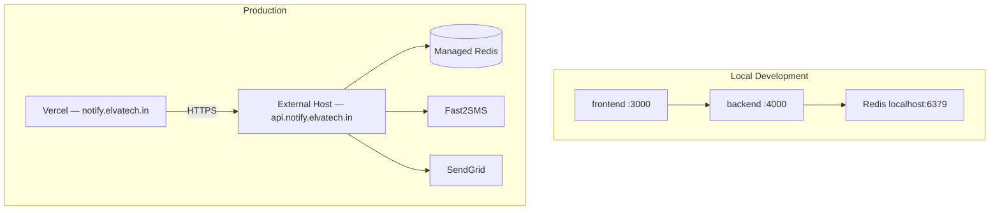

## Build Pipeline

| Package | Command | Output |
|---------|---------|--------|
| Frontend | `npm run build` (in `frontend/`) | `.next/` + generated manifests |
| Backend | No build step | Direct `node src/server.js` |
| Root | `npm run build` | Frontend only |

**Pre-build hooks:** Generate docs-manifest and openapi-manifest.

## Deployment Pipeline

| Component | Method |
|-----------|--------|
| Frontend | Vercel auto-deploy (git push, root dir `frontend/`) |
| Backend | Manual/external (no CI/CD in repo) |

## Rollback Strategy

**Not automated.** Documented in runbooks:

- `docs/runbooks/otp-dlt-rollback.md` — set `OTP_DLT_ENABLED=false` or per-brand `legacyRouteEnabled: true`
- Redeploy previous backend version externally
- Vercel instant rollback for frontend

---

# SECTION 18: PERFORMANCE ANALYSIS

## Bottlenecks

| Bottleneck | Risk | Details |
|------------|------|---------|
| **Synchronous provider calls** | High | Every request blocks on Fast2SMS/SendGrid HTTP (~200ms–2s) |
| **No connection pooling config** | Medium | Single Redis client; fetch() creates new connections per SMS |
| **Parallel recipient sends** | Medium | `Promise.all` over recipients — N recipients = N provider calls in parallel |
| **In-memory rate limiter** | Medium | Global 10/min uses `express-rate-limit` in-memory — not shared across instances |
| **JSON file reads at startup** | Low | All config loaded once; runtime reads from memory |
| **Log buffer memory** | Low | Fixed 1000 entries |

## Slow Queries

No SQL. Redis operations are O(1) key lookups. No slow query log.

## Synchronous Operations

**Everything is synchronous.** Request thread waits for:
1. Redis read/write
2. Fast2SMS HTTP response
3. SendGrid HTTP response

## Expensive Calls

| Call | Per Request | Notes |
|------|-------------|-------|
| Fast2SMS bulkV2 | 1–N (recipients) | Dominant latency |
| SendGrid send | 1 | Email delivery |
| scrypt hash (OTP) | 2 (generate + verify) | CPU-bound, configurable cost |
| Redis multi/exec | 1–3 | Minimal |

## Risks

1. Provider latency directly impacts API p99.
2. Multi-instance deployment breaks in-memory global rate limiter accuracy.
3. No circuit breaker — cascading failures during provider outage.
4. No request timeout on Fast2SMS fetch — hung connections possible.

---

# SECTION 19: SCALABILITY ANALYSIS

## Current Throughput Estimates

No load test results in repo. Theoretical limits:

| Dimension | Estimate | Basis |
|-----------|----------|-------|
| Messages/minute | ~100–500/instance | Bounded by sync Fast2SMS latency |
| Concurrent requests | ~Node.js default (~few hundred) | Single-threaded event loop |
| OTP verify/minute | Higher than send | No provider call, Redis only |

## Scaling Limitations

| Component | Limitation |
|-----------|------------|
| **Horizontal scaling** | Global rate limiter is in-memory per instance |
| **Database** | N/A — Redis is single-point for OTP state |
| **Queue** | N/A — no async buffering for traffic spikes |
| **Provider** | Fast2SMS account rate limits (external) |
| **Config changes** | Require process restart |

## Horizontal Scaling Blockers

1. In-memory `express-rate-limit` not Redis-backed for global limit.
2. In-memory log buffer not shared across instances.
3. JSON config file writes (brand approval) not safe for multi-writer without file locking.
4. No sticky sessions needed (stateless except Redis), but rate limits become inconsistent.

## Database Bottlenecks

Redis is the only datastore bottleneck:
- All OTP ops hit Redis
- Rate limit counters hit Redis
- No Redis Cluster configuration in code

## Queue Bottlenecks

N/A — no queues.

## Provider Bottlenecks

Single SMS provider (Fast2SMS). Single email provider (SendGrid). No provider load balancing.

---

# SECTION 20: SECURITY REVIEW

## Findings

| Severity | Finding | Location |
|----------|---------|----------|
| **High** | API keys sent in request body (may be logged by proxies) | All protected endpoints |
| **High** | CORS `origin: '*'` on backend | `app.js` |
| **High** | `/ops/logs` unauthenticated — exposes recent logs | `ops.routes.js` |
| **Medium** | Ops admin token in header only — no rotation mechanism | `requireOpsAdmin.js` |
| **Medium** | Brand registry JSON writable at runtime without audit trail | `brandRegistry.service.js` |
| **Medium** | Legacy SMS route `q` bypasses DLT (regulatory risk) | `notify.controller.js` |
| **Medium** | Dev-only provider error details leak in development | `buildDevProviderError` |
| **Low** | No request body size limit configured | `express.json()` default |
| **Low** | Email HTML not sanitized (XSS in email clients) | Client-supplied HTML |
| **Info** | OTP hashed with scrypt — good | `otpCrypto.js` |
| **Info** | Timing-safe compare — good | `digestsEqual` |
| **Info** | OTP values redacted in logs — good | `otpLogRedaction.js` |
| **Info** | Error messages sanitized for secrets — good | `notify.controller.js` |

## Secrets Management

Environment variables in `.env` — no encryption at rest, no rotation automation.

## Injection Risks

- No SQL injection (no SQL).
- Template variables validated against schema — limited injection surface.
- Legacy SMS `message` field passed directly to provider — content injection possible but provider-side.

## Authorization Gaps

- Platform GET endpoints unauthenticated (metadata exposure — intentional for docs).
- Integration submit endpoint unauthenticated (intentional for onboarding, abuse risk via spam requests).

## Sensitive Data Exposure

- OTP never stored plaintext in Redis (hashed).
- Provider API keys never logged (redacted).
- `/ops/logs` may contain phone numbers and partial provider responses.

## Compliance Concerns

- DLT legacy route still available — regulatory exposure for non-compliant SMS.
- No data retention policy in code for logs or Redis.
- No GDPR/privacy deletion workflow.

---

# SECTION 21: KNOWN TECHNICAL DEBT

| Priority | Item | Impact |
|----------|------|--------|
| **P0** | No CI/CD pipeline | Manual deploy risk, no automated tests |
| **P0** | Global rate limiter in-memory | Incorrect limits under multi-instance |
| **P1** | Dual config systems (JSON + code modules + legacy otp-mappings) | Confusion, drift risk |
| **P1** | Root README outdated (appId-scoped OTP keys vs brandId) | Integration errors |
| **P1** | No delivery report webhooks | Cannot confirm actual SMS delivery |
| **P1** | Synchronous-only architecture | Cannot absorb traffic spikes |
| **P2** | Legacy ops HTML viewers coexist with Next.js portal | Duplicate maintenance |
| **P2** | OpenAPI spec incomplete (missing platform/integrations/ops) | API discovery gap |
| **P2** | Single SMS/email provider | No failover |
| **P2** | Brand registry JSON file writes without locking | Race condition on concurrent approvals |
| **P3** | `buildTemplateHtml` is minimal placeholder | Poor email template UX |
| **P3** | No Docker/container definition | Inconsistent deployment |
| **P3** | Hardcoded Fast2SMS URL | Provider migration requires code change |

---

# SECTION 22: PRODUCTION TROUBLESHOOTING GUIDE

## Runbook: SMS Not Sending

1. **Verify credentials:** Confirm `FAST2SMS_API_KEY` set and valid.
2. **Check brand status:** `GET /platform/brands` — brand must be `active`.
3. **Check DLT config:** `OTP_DLT_ENABLED=true` AND brand `otpPolicy.dltEnabled=true` for DLT path.
4. **Find requestId** in client error response.
5. **Search logs** for `fast2sms_dlt_rejected` or `provider_response_failed`.
6. **Validate template metadata:** Run `npm run validate:businesses`.
7. **Test DLT payload:** Check `dlt_payload_ready` log for `senderId`, `entityId`, `templateId`.
8. **Hybrid fallback:** For `cms` brand, check `otp_dlt_fallback` events.
9. **Provider status:** Test Fast2SMS API directly with curl (see `docs/runbooks/otp-dlt-outage.md`).
10. **Legacy test:** Temporarily set `legacyRouteEnabled: true` to isolate DLT vs provider issues.

## Runbook: Email Not Sending

1. Verify `SENDGRID_API_KEY` and `EMAIL_FROM` configured.
2. Check SendGrid sender verification for `EMAIL_FROM` domain.
3. Search logs for `notification_failed` with `providerMessage`.
4. Test with playground `/playground` EMAIL notify.
5. Check SendGrid dashboard for bounces/blocks (external).

## Runbook: Queue Backlog

**N/A** — system has no queues. If experiencing delayed responses, see High Latency runbook.

## Runbook: High Latency

1. Check Fast2SMS response times in `provider_response` logs (`durationMs`).
2. Check Redis latency (connection timeouts in logs: `Redis Client Error`).
3. Verify not sending to many recipients in single request (parallel provider calls).
4. Check if global rate limiter causing 429 delays.
5. Profile Node.js event loop if CPU-saturated (scrypt on high verify volume).

## Runbook: Database (Redis) Failures

1. Check `Redis Client Error` in stdout logs.
2. Verify `REDIS_URL` or `REDIS_HOST`/`REDIS_PORT`/`REDIS_TLS` config.
3. Test connectivity: `redis-cli -u $REDIS_URL ping`.
4. OTP operations return 500 — service may still respond to `/health` if Redis fails mid-request.
5. Restart backend after Redis recovery — client reconnects on next op.

## Runbook: Provider Failures

1. Consult `docs/runbooks/otp-dlt-outage.md`.
2. Emergency rollback: set `OTP_DLT_ENABLED=false` (all OTP → route `q`).
3. Per-brand: set `legacyRouteEnabled: true` in brand registry.
4. Monitor `GET /health` → `otpDlt` summary.
5. Run `npm run otp:health` for retirement gate status.

---

# SECTION 23: SCALE TO 10X PLAN

## Current Risks at 10X Traffic

| Risk | At 10X Impact |
|------|---------------|
| Sync provider calls | Thread pool exhaustion, high p99 |
| In-memory rate limits | Under/over-limiting |
| Single Redis instance | CPU/memory ceiling |
| No queue buffering | Spike drops during provider slowdown |
| JSON config file writes | Approval race conditions |
| Single Fast2SMS account | Provider throttling |

## Required Architectural Changes

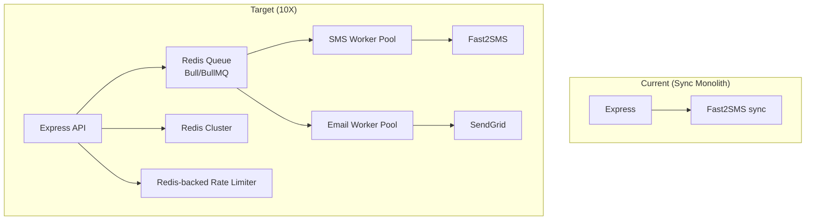

### Phase 1 — Quick Wins (No Architecture Change)

1. Move global rate limiter to Redis (`rate-limiter-flexible`).
2. Add Fast2SMS request timeout (5–10s).
3. Add circuit breaker for provider calls.
4. Deploy multiple backend instances behind load balancer.
5. Use managed Redis with replication.

### Phase 2 — Async Dispatch

1. Introduce BullMQ queue for SMS/email dispatch.
2. Return 202 Accepted with `messageId` for async tracking.
3. Separate worker processes for provider calls.
4. Dead letter queue for failed messages with retry (exponential backoff).

### Phase 3 — Data & Config

1. Move brand registry to PostgreSQL or DynamoDB.
2. Add delivery report webhook endpoint for Fast2SMS DLR.
3. Redis Cluster for OTP sharding by brandId.
4. Config hot-reload via watch or admin API.

### Phase 4 — Multi-Region

1. Primary region: India (ap-south-1 or Mumbai) for Fast2SMS latency.
2. Redis Global Datastore or region-local Redis with brand routing.
3. Read replicas for platform metadata API.
4. Vercel edge for docs portal.

## Queue Improvements

| Current | Target |
|---------|--------|
| None | BullMQ with Redis backing |
| Sync response | 202 + polling/webhook status |
| No retry | 3 retries with exponential backoff |
| No DLQ | DLQ with 7-day retention |

## Database Improvements

| Current | Target |
|---------|--------|
| Redis only | Redis (hot) + PostgreSQL (config, audit, message log) |
| JSON files | DB-backed brand registry with migrations |
| No message history | Append-only `messages` table |

## Caching Improvements

1. Cache brand registry in memory with TTL + file watch.
2. Cache template schemas (already in memory post-startup).
3. CDN cache for `GET /platform/*` responses.

---

# SECTION 24: CODE REFERENCES

## OTP Send Pipeline

| Feature | File | Function/Class |
|---------|------|----------------|
| Route definition | `backend/src/routes/otp.routes.js` | Router mount + middleware chain |
| HTTP handler | `backend/src/controllers/otp.controller.js` | `sendOtp`, `sendOtpImpl` |
| OTP generation | `backend/src/services/otp.service.js` | `generateOTP` |
| Notification dispatch | `backend/src/services/notification.service.js` | `sendNotification`, `sendOtpSmsToRecipients` |
| DLT policy | `backend/src/services/otpDltResolver.service.js` | `getOtpDeliveryPolicyByBrand`, `buildOtpTemplateContext` |
| DLT payload | `backend/src/services/dltPayloadResolver.service.js` | `buildDltPayload` |
| Fast2SMS DLT | `backend/src/services/sms/providers/fast2sms.js` | `sendDltSMS` |
| Fast2SMS legacy | `backend/src/services/sms/providers/fast2sms.js` | `sendSMS` |
| Cooldown | `backend/src/services/otpCooldown.service.js` | `applyAfterSuccessfulSend` |
| Rate limit | `backend/src/middleware/rateLimitOtpSend.js` | `rateLimitOtpSend` |

## OTP Verify Pipeline

| Feature | File | Function |
|---------|------|----------|
| HTTP handler | `backend/src/controllers/otp.controller.js` | `verifyOtp` |
| Verification logic | `backend/src/services/otp.service.js` | `verifyOTP` |
| Crypto | `backend/src/utils/otpCrypto.js` | `hashOtp`, `digestsEqual`, `generateSixDigitOtp` |
| Redis keys | `backend/src/services/redis.service.js` | `otpKey`, `getHashAll`, `hashIncrementBy` |

## Notify (DLT Template) Pipeline

| Feature | File | Function |
|---------|------|----------|
| HTTP handler | `backend/src/controllers/notify.controller.js` | `handleNotify` |
| SMS mode detection | `backend/src/services/templateValidation/notifyMode.js` | `classifyNotifySmsMode`, `resolveNotifyBusinessId` |
| Template validation | `backend/src/services/templateValidation/templateValidation.service.js` | `validateTemplateRequest` |
| Variable validation | `backend/src/services/templateValidation/variableValidator.js` | `validateVariables` |
| Brand gate | `backend/src/middleware/validateApprovedBrand.js` | `validateApprovedBrandForNotify` |
| SMS dispatch | `backend/src/services/sms/sms.service.js` | `sendDltTemplated` |

## Authentication

| Feature | File | Function |
|---------|------|----------|
| API key validation | `backend/src/middleware/validateAppApiKey.js` | `validateAppApiKey` |
| Credential loading | `backend/src/config/allowedApps.js` | `allowedApps` |
| Admin auth | `backend/src/middleware/requireOpsAdmin.js` | `requireOpsAdmin` |

## Brand Registry & Onboarding

| Feature | File | Function |
|---------|------|----------|
| Brand CRUD | `backend/src/services/brandRegistry.service.js` | `getBrand`, `upsertActiveBrand`, `resolveBrandFromNotifyBody` |
| Request workflow | `backend/src/services/brandRequest.service.js` | `createBrandRequest`, `approveBrandRequest` |
| Admin controller | `backend/src/controllers/integration.controller.js` | `approveRequestAdmin`, `submitRequest` |
| Registry data | `backend/config/tenants/brand-registry.json` | — |

## Email Pipeline

| Feature | File | Function |
|---------|------|----------|
| SendGrid send | `backend/src/services/email/email.service.js` | `sendEmail` |
| OTP email template | `backend/src/services/email/emailTemplates.js` | `getOtpTemplate`, `getOtpEmailSubject` |
| Email handler | `backend/src/services/notification.service.js` | `handleEmail`, `buildTemplateHtml` |

## Logging & Observability

| Feature | File | Function |
|---------|------|----------|
| Structured logger | `backend/src/services/logging/businessLogger.service.js` | `logOtp`, `logDlt`, `logNotification` |
| Log context | `backend/src/services/logging/logContext.js` | `buildLogContext`, `recipientFromList` |
| Log buffer | `backend/src/services/logBuffer.service.js` | `append`, `getLogs` |
| OTP redaction | `backend/src/utils/otpLogRedaction.js` | `maskVariablesValues`, `redactResolvedVariables` |
| Request ID | `backend/src/middleware/requestId.js` | `requestId` |

## Configuration & Startup

| Feature | File | Function |
|---------|------|----------|
| Environment | `backend/src/config/env.js` | Config export |
| Business loader | `backend/src/businesses/configLoader.js` | Config loading |
| Business registry | `backend/src/businesses/registry.js` | `getBusiness`, `getTemplate` |
| Startup bootstrap | `backend/src/businesses/index.js` | Validation + health snapshots |
| Server entry | `backend/src/server.js` | HTTP server + graceful shutdown |
| Express app | `backend/src/app.js` | Middleware + routes |

## Frontend Integration

| Feature | File | Function/Export |
|---------|------|-----------------|
| API base URL | `frontend/lib/config.ts` | `API_BASE_URL` |
| Platform API | `frontend/lib/platform-api.ts` | Platform fetch helpers |
| Integration API | `frontend/lib/integration-api.ts` | Onboarding fetch helpers |
| Playground tester | `frontend/components/playground/api-endpoint-tester.tsx` | Direct API calls |

## Template Catalog (ApnaKart)

| Feature | File |
|---------|------|
| Business metadata | `backend/config/businesses/apnakart/business.json` |
| Template definitions | `backend/config/businesses/apnakart/templates.json` |
| OpenAPI contract | `backend/openapi/openapi.yaml` |

---

# SECTION 25: FINAL KNOWLEDGE TRANSFER

## 1-Day Onboarding Guide

### Hour 1 — Orientation

1. Read this document Sections 1–2 (executive summary + architecture).
2. Clone repo, copy `backend/.env.example` → `backend/.env`.
3. Start local stack: `npm run dev` (backend :4000, frontend :3000).
4. Open `http://localhost:3000` — explore docs, playground, platform dashboard.

### Hour 2 — Run It Locally

1. Ensure Redis running locally (`redis-server` or Docker).
2. Set `APP_CREDENTIALS_JSON`, `FAST2SMS_API_KEY`, `SENDGRID_API_KEY`, `EMAIL_FROM`.
3. Send test OTP via playground with `brandId: enandi`.
4. Watch logs in terminal and `GET http://localhost:4000/ops/logs`.
5. Verify OTP with `/otp/verify`.

### Hour 3 — Trace a Request

1. Set breakpoint or add log in `otp.controller.js` → `sendOtpImpl`.
2. Follow call chain through `notification.service.js` → `fast2sms.js`.
3. Inspect Redis key: `otp:enandi:{phone}`.
4. Read `brand-registry.json` and `apnakart/templates.json`.

### Hour 4 — DLT Deep Dive

1. Read Section 8 of this document.
2. Read `docs/architecture/dlt-layer.md`.
3. Compare DLT-only (`enandi`) vs hybrid (`cms`) brands.
4. Run `npm run otp:health` and inspect `.generated/otp-health-snapshot.json`.

### Hour 5 — API & Integration

1. Browse `http://localhost:3000/api-reference`.
2. Read `docs/api/authentication.md`, `docs/api/otp.md`, `docs/api/notify.md`.
3. Test DLT notify: `ORDER_PLACED` template via playground.
4. Walk through onboarding flow at `/onboard`.

### Hour 6 — Operations

1. Read runbooks in `docs/runbooks/`.
2. Visit `/platform/otp` rollout dashboard.
3. Simulate provider failure (invalid API key) — observe 502 + OTP revocation.
4. Review Section 20 (security findings).

### Hour 7 — Deployment & Scale

1. Read Section 17 (deployment) and Section 23 (10X plan).
2. Review `frontend/vercel.json` and production URLs.
3. Understand what's NOT in repo (backend deploy, CI/CD).

### Hour 8 — Ownership Handoff

1. Identify your first on-call scenarios (Section 22 runbooks).
2. Document your production Redis/provider credentials access path.
3. List open P0 debt items (Section 21) for sprint planning.

## What to Learn First

1. **Request flow:** OTP send → Redis → Fast2SMS → verify
2. **Two ID systems:** `appId` (platform auth) vs `brandId` (tenant isolation)
3. **DLT policy model:** global switch + per-brand policy + delivery modes
4. **Config files:** brand-registry.json + apnakart/templates.json

## Critical Services

| Service | Why Critical |
|---------|--------------|
| Express backend (`backend/src/server.js`) | All API traffic |
| Redis | OTP state — outage = OTP broken |
| Fast2SMS | SMS delivery — outage = no SMS |
| SendGrid | Email delivery |
| brand-registry.json | Authorization gate for all SMS |

## Critical Dependencies

| Dependency | Minimum Version | Purpose |
|------------|-----------------|---------|
| Node.js | 18+ | Runtime |
| Redis | 6+ | OTP + rate limits |
| Fast2SMS account | Active | SMS provider |
| SendGrid account | Active | Email provider |
| DLT registration | Active PEID + templates | Legal SMS in India |

## Production Risk Areas

| Area | Risk | Mitigation |
|------|------|------------|
| DLT rollout | SMS rejection at scale | Monitor `fast2sms_dlt_rejected`, use hybrid fallback brands |
| Redis SPOF | Total OTP outage | Managed Redis with failover |
| Secrets in `.env` | Leak/rotation | Move to secrets manager |
| Unauthenticated `/ops/logs` | Info disclosure | Add auth or disable in prod |
| No CI/CD | Bad deploys | Add GitHub Actions pipeline |
| Sync architecture | Latency under load | Plan queue-based dispatch (Section 23) |

---

## Appendix A: Related Documentation in Repo

| Document | Path |
|----------|------|
| Platform docs index | `docs/README.md` |
| Architecture overview | `docs/architecture/overview.md` |
| Request lifecycle | `docs/architecture/request-lifecycle.md` |
| DLT layer | `docs/architecture/dlt-layer.md` |
| v2 architecture vision | `docs/architecture/ELVA_NOTIFY_V2_ARCHITECTURE.md` |
| Logging specification | `docs/architecture/LOGGING_SPECIFICATION.md` |
| OTP API narrative | `docs/api/otp.md` |
| Notify API narrative | `docs/api/notify.md` |
| Authentication | `docs/api/authentication.md` |
| Error codes | `docs/api/error-codes.md` |
| DLT outage runbook | `docs/runbooks/otp-dlt-outage.md` |
| DLT rollback runbook | `docs/runbooks/otp-dlt-rollback.md` |
| Business onboarding | `docs/runbooks/business-onboarding.md` |
| Integration guide | `docs/getting-started/end-to-end-integration-guide.md` |

## Appendix B: Glossary

| Term | Meaning |
|------|---------|
| **PEID / entityId** | DLT Principal Entity ID registered with TRAI |
| **DLT templateId** | TRAI-approved template identifier |
| **messageId** | Fast2SMS internal message template ID |
| **Sender ID / header** | SMS originating address (e.g. `ELVATK`) |
| **route q** | Fast2SMS non-DLT free-text route |
| **route dlt** | Fast2SMS DLT-compliant templated route |
| **brandId** | Tenant slug for OTP isolation and brand gate |
| **appId** | Platform API credential identifier |
| **businessModule** | Template catalog namespace (e.g. `apnakart`) |

---

*End of document. Generated from full repository reverse-engineering audit.*
